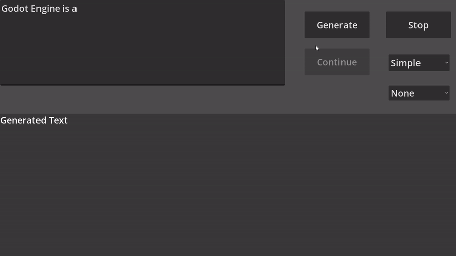
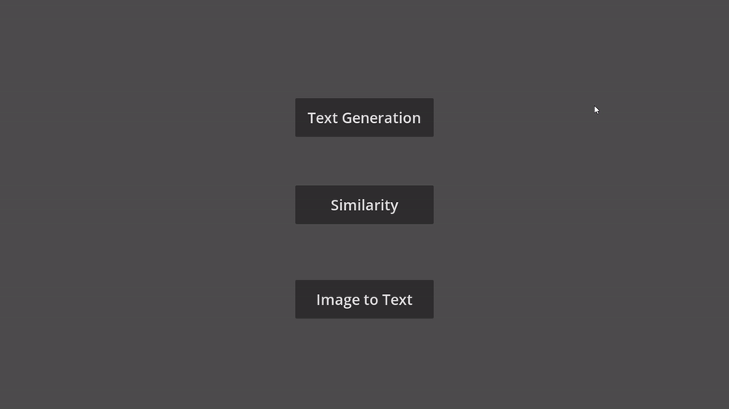
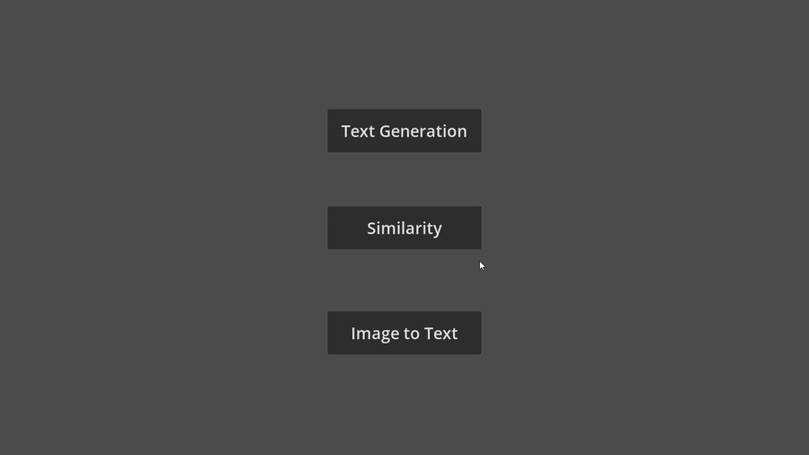

# Godot LLM template
A template/demo to show how to use the [godot-llm](https://github.com/Adriankhl/godot-llm) addon

## Text generation


## Similarity


## Image to text


# How to use
You may simply download the Android apk in the release page to try it out for Android devices.

For Windows/Linux:
1. Get the `Godot LLM Template` from the Godot asset library, or clone this project: `git clone https://github.com/Adriankhl/godot-llm-template.git`
2. Get `Godot LLM` directly from the godot asset library, or download the addon from [godot-llm](https://github.com/Adriankhl/godot-llm) and place it to the `addons` folder
3. [Download models](#download-models)
4. Run the project with Godot or export an Android apk (requires the `Manage External Storage` permission)

## Download models
* Text generation recommendation: [Meta-Llama-3-8B-Instruct-Q5_K_M.gguf](https://huggingface.co/lmstudio-community/Meta-Llama-3-8B-Instruct-GGUF/tree/main) or [Phi-3-mini-4k-instruct-Q2_K.gguf](https://huggingface.co/bartowski/Phi-3-mini-4k-instruct-GGUF/tree/main) for low-end devices such as Android phone
* Similarity recommendation: [mxbai-embed-large-v1.Q5_K_M.gguf](https://huggingface.co/ChristianAzinn/mxbai-embed-large-v1-gguf/tree/main)
* Image to text recommendation: [llava-phi-3-mini-int4.gguf](https://huggingface.co/xtuner/llava-phi-3-mini-gguf/tree/main), also download the `llava-phi-3-mini-mmproj-f16.gguf` from the same page

Folder and file structure:
```
├── addons
│   └── godot_llm
│       ├── bin
│       │   ├── libgodot_llm.android.debug.aarch64.so
│       │   ├── libgodot_llm.android.release.aarch64.so
│       │   ├── libgodot_llm.linux.debug.x86_64.so
│       │   ├── libgodot_llm.linux.release.x86_64.so
│       │   ├── libgodot_llm.windows.debug.amd64.dll
│       │   └── libgodot_llm.windows.release.amd64.dll
│       └── godot_llm.gdextension
├── icon.svg
├── icon.svg.import
├── image_to_text.gd
├── image_to_text.tscn
├── LICENSE
├── main.gd
├── main.tscn
├── media
├── project.godot
├── README.md
├── similarity.gd
├── similarity.tscn
├── text_generation.gd
└── text_generation.tscn
```

You can now open the application with Godot

# The application

You will see 3 modes: `Text Generation`, `Similarity`, `Image to Text`

In each mode, you need to clide `Model` to point to the correct model `gguf` file. Addition, in `Image to Text` mode, you need to click `Mmproj` to point to your `*mmproj*gguf` file.

## Text Generation

You will see there are 3 generation mode: `Simple`, `Instruct`, and `Interactive`. 

### `Simple` mode
Just edit the prompt and click `Generate`. Click `Stop` to stop the generation.

You choose `None` schema or `Person` schema, if you choose `None` schema, the model will generate the information of a character with Json format.

### `Instruct` mode
Click `Start` first with empty prompt, then modify the prompt and click `Continue` when it is available to talk to the AI. This is an interactive mode. Whenever you see the `Continue` button is available, either input something in the prompt and click `Continue` to send the input, or simply click `Continue` to let the AI talk itself.

### `Interactive` mode
Similar to the instruct mode, except that it relies on a good initial prompt and additoinal reverse prompt and input suffix settings to generate a smooth conversation. The preset prompt should work decently well, click the `Start` button with the preset prompt and start talkin to the AI.

## Similarity
Input prompts to compute the `Embedding`, or input two prompts to calculate their `Similarity`

## Image to Text
Select an `Image` from your device. Alternative, click `From View` to capture your game screen as the image. You can `Compute Base64` encoding for your image, or decode a base64 string back to `Compute Image`. Edit the prompt, and generate text from `Image`, `Base64`, or `View` (your game screen).