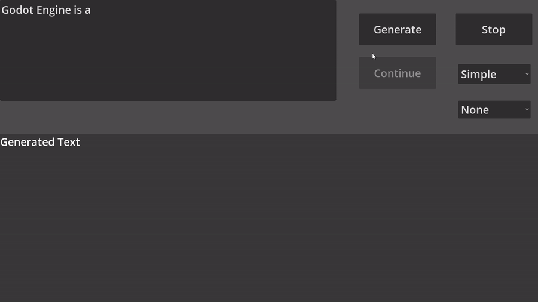

# Godot LLM template
A demo to show how to use the [godot-llm](https://github.com/Adriankhl/godot-llm) addon



# How to use
1. Clone this project: `git clone https://github.com/Adriankhl/godot-llm-template.git`
2. Download the addon from [godot-llm](https://github.com/Adriankhl/godot-llm) and place it to the `addons` folder, or get `Godot LLM` directly from the godot asset library
3. Create a `models` folder, download [Meta-Llama-3-8B-Instruct-Q5_K_M.gguf](https://huggingface.co/lmstudio-community/Meta-Llama-3-8B-Instruct-GGUF/tree/main) and place it in `models`
4. Run the project with Godot

Folder and file structure:
```
├── addons
│   └── godot_llm
│       ├── bin
│       │   ├── libgodot_llm.android.debug.aarch64.so
│       │   ├── libgodot_llm.android.release.aarch64.so
│       │   ├── libgodot_llm.linux.debug.x86_64.so
│       │   ├── libgodot_llm.linux.release.x86_64.so
│       │   ├── libgodot_llm.windows.debug.amd64.dll
│       │   ├── ~libgodot_llm.windows.release.amd64.dll
│       │   └── libgodot_llm.windows.release.amd64.dll
│       └── godot_llm.gdextension
├── icon.svg
├── icon.svg.import
├── LICENSE
├── llama.gd
├── main.gd
├── main.tscn
├── media
│   └── demo.gif
├── models
│   └── Meta-Llama-3-8B-Instruct.Q5_K_M.gguf
├── project.godot
└── README.md
```

Once you open the application, you will see there are 3 generation mode: `Simple`, `Instruct`, and `Interactive`. 

# `Simple` mode
Just edit the prompt and click `Generate`.

You choose `None` schema or `Person` schema, if you choose `None` schema, the model will generate the information of a character with Json format.

# `Instruct` mode
Click `Start` first with empty prompt, then modify the prompt and click `Continue` when it is available to talk to the AI. This is an interactive mode. Whenever you see the `Continue` button is available, either input something in the prompt and click `Continue` to send the input, or simply click `Continue` to let the AI talk itself.

# `Interactive` mode
Similar to the instruct mode, except that it relies on a good initial prompt and additoinal reverse prompt and input suffix settings to generate a smooth conversation. The preset prompt should work decently well, click the `Start` button with the preset prompt and start talkin to the AI.
